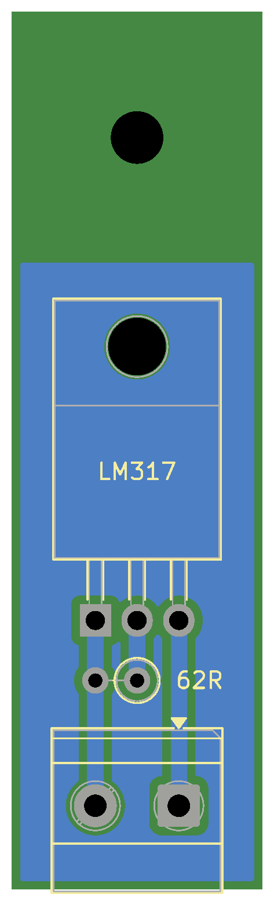
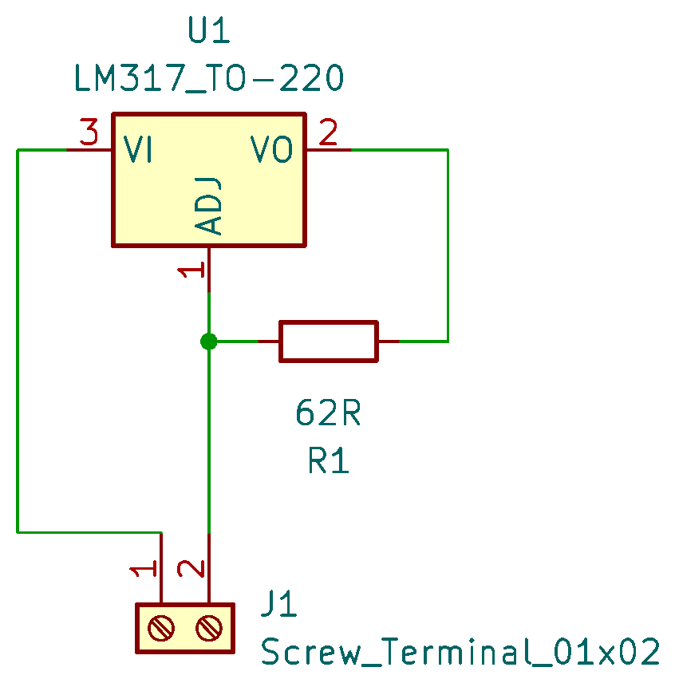

# Current Limiter

This is a simple PCB that uses a LM317 and a 68Ω resistor to make a 20mA current limiter that adjusts for different voltages.

The circuit is so simple that a PCB is not really necessary. If you build one without a PCB, remember that the exposed metal on the TO-220 version is connected to voltage out and should be isolated if it needs cooling.

