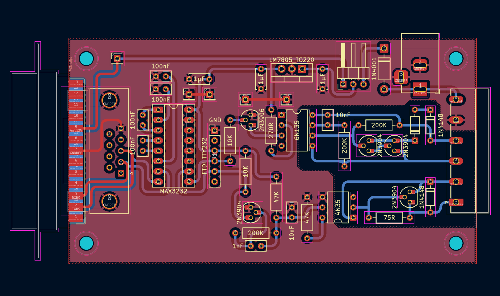

# CL-232

## In progress - Ver 0.4

This is a current loop to 5V Logic/RS232 adapter for using old old hardware or serial communication over a long distance, old old school style.

The adapter is based on B&B electronics [design](Documents/B&B%20Electronics%20-%20232CL9R.pdf) with some additions sutch as running of a Amiga serial ports power or skipping the whole RS232 to 5V Logic converter part and run it of a USB to TTL232 adapter. 

I also changed the 5V Logic <-> RS232 chip to a single MAX3232 which has the added benefit to only need +5v instead of the old design needing +/-12v, this also makes the adapter able to run on USB power. The Current Loop probably needs more than 5v to get any length going but it should be possible to get a short link going with just 5v, all the old documentation I have found uses 12v or more. 

## Current Limiter
In the folder [CurrentLimiter](CurrentLimiter) there is a simple Current Limiter based on a LM317 and a 62Ω resistor. This current limiter works on a loop up to 40 volts.